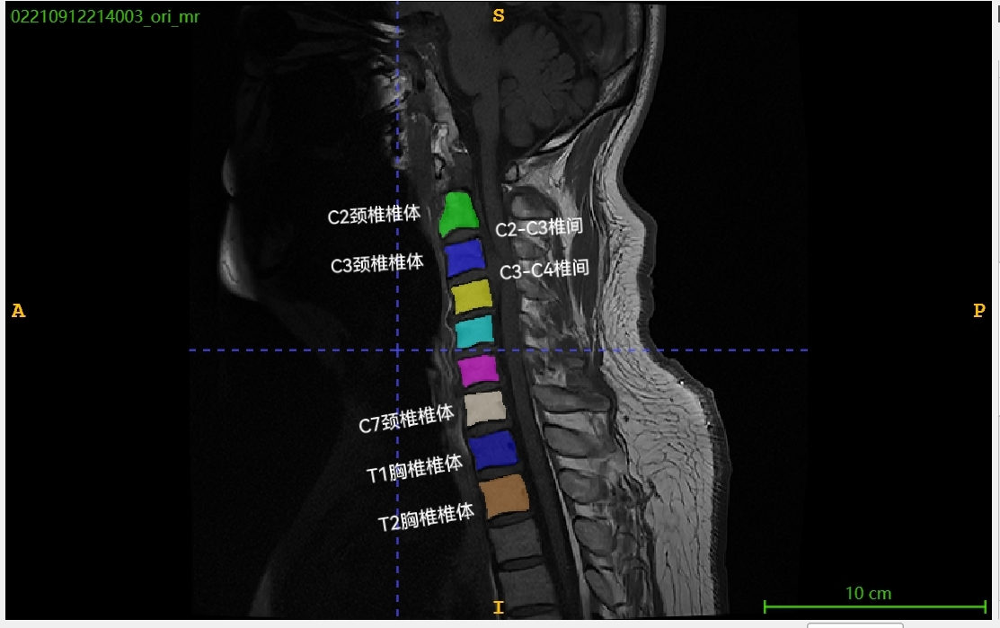

# 颈椎核磁影像多序列多任务分析挑战赛 （CervAI Challenge）

## 1. 赛题背景

现代社会，越来越多的人因长时间伏案工作、低头看手机、缺乏运动而出现颈椎问题，颈椎病已成为白领、学生、司机等人群的常见疾病。轻者会导致颈肩疼痛、头晕头痛，重者甚至影响神经系统，导致肢体麻木、行走困难，极大降低生活质量。如何更早、更准确地发现颈椎异常？如何利用人工智能提高医学影像分析的效率？

磁共振成像（MRI）是临床上用于颈椎疾病诊断的核心影像技术，能够提供高分辨率的软组织信息。然而，目前的颈椎MRI解读主要依赖放射科医生的经验，不仅费时费力，而且在复杂病例下可能存在一定主观差异。随着人工智能（AI）在医学影像领域的突破性发展，深度学习技术正在助力医生更高效、精准地解读医学影像，为早期诊断和治疗提供有力支持。

本赛题的目标是借助人工智能技术，自动分析T2矢状位和T2横轴位的颈椎MRI图像，完成颈椎曲度、顺列、椎间盘、椎管的智能评估，助力临床医生快速识别颈椎异常，提高诊断效率。本赛题不仅具有医学价值，还能让参赛者深入探索计算机视觉、深度学习、多任务学习、多模态大模型等前沿技术，体验人工智能如何改变医疗健康。

如果你对医学影像分析、深度学习、医学多模态大模型技术感兴趣，希望你的AI算法能真正影响现实世界的健康诊疗，欢迎挑战本赛题！

图 1. MRI 矢状位和横轴位扫描示例

## 2. 赛题任务
参赛者需针对每个患者的多序列MRI影像，完成以下任务：

### 任务1：颈椎曲度评估
- **目标**：判断颈椎生理曲度状态，分类为：
  - 正常（标签0）
  - 曲度变直（标签1）
  - 反弓（标签2）

- **说明**：颈椎曲度是指颈椎自然的生理弯曲，通常呈前凸（C形）。曲度评估分为三种：直（生理曲度消失）、正常（前凸曲度良好）、反弓（曲度反向，呈后凸）。 颈椎曲度的异常可能导致椎间盘压力不均、神经受压或脊髓损伤，评估这些指标有助于早期发现颈椎病变，指导治疗并预防神经功能损害。（* From Deepseek）

- **相关图像数据**：建议使用矢状位图像

### 任务2：颈椎顺列评估
- **目标**：判断颈椎顺列状态，分类为：
  - 顺列差（标签0）
  - 顺列可（标签1）

- **说明**：顺列是指颈椎椎体之间的排列关系。顺列评估分为顺列差（椎体排列不齐，可能存在脱位或滑脱）和顺列可（排列基本正常）。颈椎顺列的异常可能导致椎间盘压力不均、神经受压或脊髓损伤，评估这些指标有助于早期发现颈椎病变，指导治疗并预防神经功能损害。 （* From Deepseek）

- **相关图像数据**：建议使用矢状位图像

### 任务3：椎间盘膨突评估
- **目标**：对 **C2-C3 至 C6-C7 共五个椎间位置** 进行状态分类：
  - 正常（标签0）
  - 膨出（标签1）
  - 突出（标签2）
  - 脱出（标签3）

- **说明**：颈椎椎间盘膨突是指颈椎间盘的外层变弱或破裂，导致内部物质向外凸出，可能会压迫附近的神经或脊髓。评估分为四种情况：正常（椎间盘没有异常），膨出（椎间盘整体轻微外凸，但外层没有破裂），突出（外层部分破裂，内部物质局部凸出），脱出（外层完全破裂，内部物质可能掉出并移位）。这种评估非常重要，因为它可以帮助判断颈椎问题的严重程度，指导治疗，并预防神经受压导致的疼痛、麻木或更严重的症状。（* From Deepseek）

- **相关图像数据**：建议使用矢状位图像和对应的横轴位图像

### 任务4：中央椎管评估
- **目标**：对 **C2、C2-C3、C3、C3-C4、...、C6-C7、C7 共11个位置** 进行分级：
  - 0级（标签0）
  - 1级（标签1）
  - 2级（标签2）
  - 3级（标签3）

 - **说明**：颈椎中央椎管是指颈椎椎管的中枢部分，包含脊髓、脑脊液及其周围的硬膜等结构，是保护脊髓和神经的重要通道。评估颈椎中央椎管通常分为0-3级：0级表示椎管正常，无狭窄或压迫；1级为轻度狭窄，脊髓无明显受压；2级为中度狭窄，脊髓受压但无明显信号改变；3级为重度狭窄，脊髓明显受压并伴有信号改变。通过评估椎管状态，能够早期诊断脊髓受压、椎管狭窄等病变，为制定治疗方案和预防神经功能损伤提供关键依据，有极其重要的意义。（* From Deepseek）

- **相关图像数据**：建议使用矢状位图像和对应的横轴位图像

### 任务5（可选）：椎体定位识别（辅助任务）
- **目标**：定位矢状位图像中各个椎体的位置，以辅助其他任务。
- **应用场景**：可作为独立任务或辅助任务，提高其他任务的准确性。

## 3. 评分指标

### （一）任务评估指标
| 任务 | 指标 | 权重 |
|----------------|--------------------------|------|
| 颈椎曲度评估 | 多类别 Macro-F1 | 20% |
| 颈椎顺列评估 | 类别0的 F1-score | 20% |
| 椎间盘膨突评估 | 多类别 Macro-F1 | 30% |
| 中央椎管评估 | 多类别 Macro-F1 | 30% |

<!-- 
| 椎体定位辅助任务 | IoU（可选加分项） | +5% |
-->

### （二）整体指标
综合得分 = Σ（任务指标 × 权重）

<!-- 
综合得分 = Σ（任务指标 × 权重） + 辅助任务加分（最高5%）
-->

### （三）最终评分构成
1. **客观指标**：占总成绩的70%，基于测试集预测结果计算。
2. **技术报告评估**：占总成绩的30%，包括创新性（10%）、方法合理性（10%）、结果分析（10%）。

## 4. 参赛要求
- **提交内容**：
  1. **测试集预测结果**（暂定JSON格式，与训练集提供的标签格式相同）
  2. **技术报告**（包含模型方法、实验分析等）
  3. **项目源代码**
- **评审方式**：
  - 计算客观评估指标，结合技术报告进行最终评分。

## 5. 数据提供

大赛将提供 400 例病人数据作为训练集，100 例病人数据作为测试集。每名病人的图像数据包含T2序列矢状位1～3张图像及横轴位多张图像，同时提供矢状位各椎体的边界框坐标信息，以及横轴位图像对应的锥体及椎间信息。仅训练集会提供四个核心任务的标注数据。

图 2. 病人矢状位图像及锥体位置样例

其中，颈椎曲度评估和颈椎顺列评估可以仅需使用T2序列矢状位图像；椎间盘膨突评估和中央椎管评估则需要结合T2序列矢状位图像和横轴位图像。颈椎曲度和颈椎顺列需要全部椎体进行判断，椎间盘膨突和中央椎管评估任务是局部任务，或许通过椎体定位的方式可以增加模型预测的准确性。

在data和script目录有更具体的说明。

> 数据准备好后，会发布样例数据

## 6. 赛题解析
本任务涉及**多任务学习、医学图像处理、类别不均衡问题**等关键挑战，可能的解决方案包括：
- 图像预训练模型+ 多任务学习框架
- 基于多模态大模型技术的多任务学习方法
	- 可以尝试医疗领域的多模态大模型，如 MedM-VL-2D-3B-en （建议使用英文的 prompt 和answer）
		- https://github.com/MSIIP/MedM-VL   中的 2D 模型
		- https://huggingface.co/shiym2000/MedM-VL-2D-3B-en
	- 也可以尝试通用领域的多模态大模型，如 Qwen2.5-VL
		- https://github.com/QwenLM/Qwen2.5-VL

---
本赛题期待参赛者探索AI在医学影像分析中的应用，推动智能诊断技术的发展。

